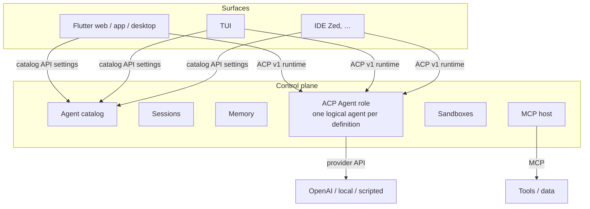
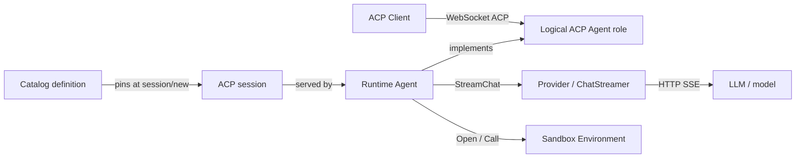
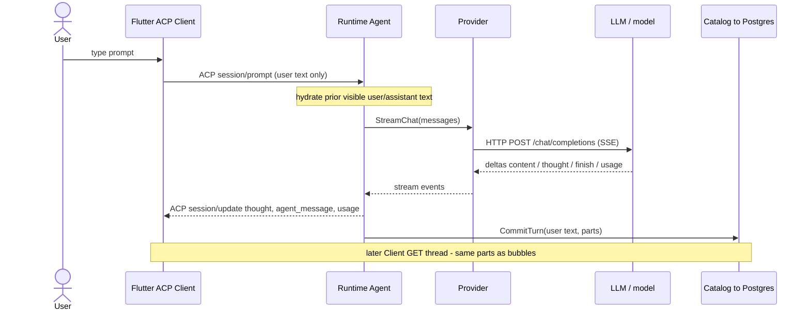
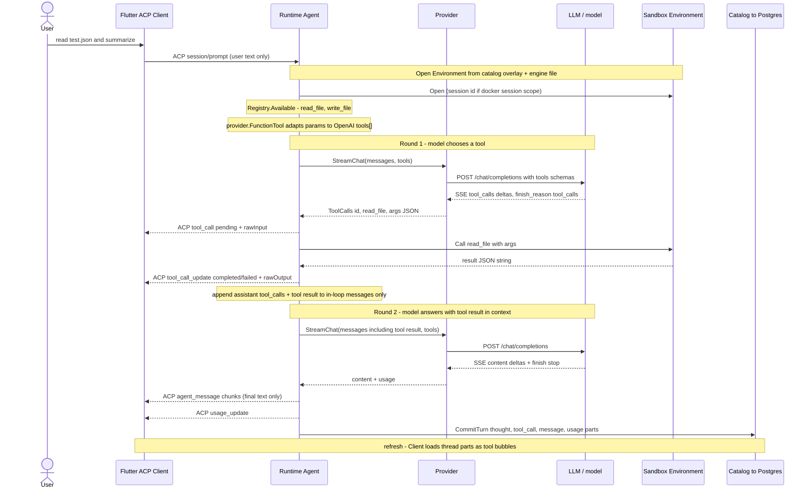
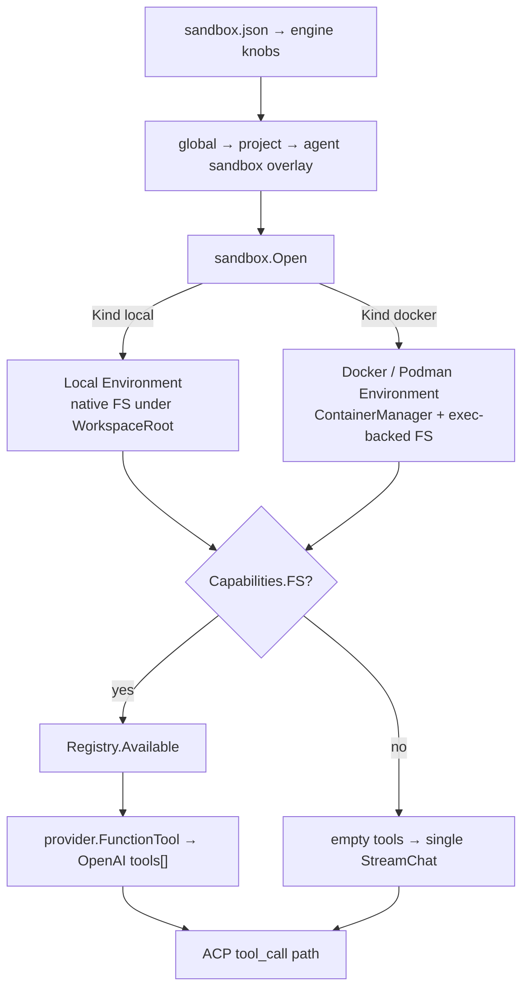
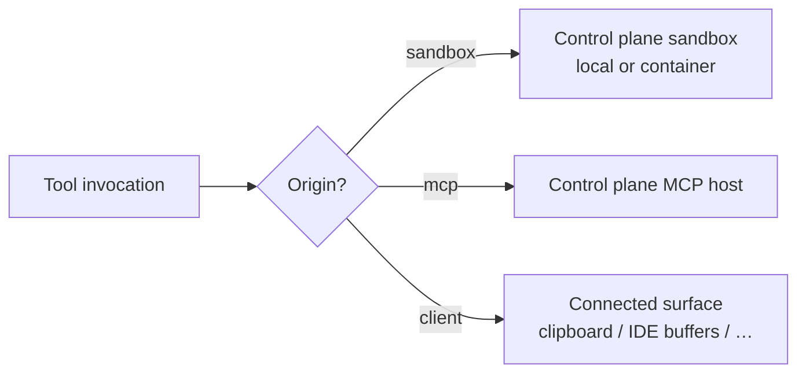

# Architecture

This is the system we are building. Decisions that led here are in [decisions.md](decisions.md).

## Goal

A **central control plane** you can chat with from web, mobile, desktop, TUI, and IDEs, with:

- Long-term, session, and project memory on the server
- Per-agent configuration (model, MCP, sandbox, capabilities)
- Isolated execution (Docker) when an agent needs a computer
- Tests that do not call a real LLM

Clients are replaceable cockpits. They do not own the agent.

## Layers

ACP names two peers: **Client** and **Agent**. Inference is not a protocol actor. The control plane *implements* the ACP Agent role for each configured definition.

## Two APIs

| API | Audience | Job |
| --- | --- | --- |
| **Catalog** (our HTTP API) | Settings UI, admin | Create/update agent definitions: model, MCP, sandbox, memory, who may use them |
| **ACP v1** | Chat UI, TUI, IDEs | Talk to an *already configured* agent |

ACP has no “create an agent with this model.” It assumes the agent exists. The catalog is how agents exist. After the user picks `work`, the client opens ACP against that agent and the rest is stock ACP (`initialize` → `session/new` → `session/prompt`).

Switching agent is a **new session on a different definition**, not a field on the current turn. Small knobs *inside* a definition (ask vs auto, optional model set) can be ACP `configOptions`.

## Agent definitions

A definition is internal config, versioned, hot-reloadable:

- Identity: id, name, description
- Provider: which inference backend and default model
- Allowed `configOptions` (optional model list, mode, …)
- MCP servers the **plane** attaches (not the Flutter app)
- Sandbox profile: none / Docker image / resource limits
- Tools and permission policy
- Memory scopes this agent may read/write
- Prompt / policy text

At `session/new`, the runtime **pins a snapshot** of the definition. In-flight turns do not mutate when you edit settings. The next session picks up the new version.

`initialize` capabilities come from that snapshot. Changing advertised capabilities requires a new connection (ACP negotiates capabilities once per connection).

One OS process can host many **logical** ACP agents. Isolation is a property of the definition (in-process vs Docker), not “one subprocess per agent” unless we choose that later.

## Runtime path

When a client sends `session/prompt` to agent `work`:

1. Resolve the session’s pinned definition
2. Hydrate memory for that definition’s scopes
3. Attach that definition’s MCP and sandbox
4. Call that definition’s provider (`scripted` or a real LLM)
5. Execute tools by **origin** (see below)
6. Stream ACP `session/update` (text, tool calls, plans, permissions)

The client never sends model, backend tools, MCP secrets, system prompt, or the canonical transcript. If an IDE still sends `cwd` / `mcpServers` on `session/new`, the plane **overrides from the definition**, except true **client-origin** tools (device MCP or `_` extension methods).

The next sections unpack that path: what “agent” means in this codebase, the live turn lifecycle, and how sandbox tools behave across backends.

## Concepts: what “agent” means

“Agent” is overloaded. These are different things:

| Term | Where it lives | What it is |
| --- | --- | --- |
| **Catalog agent definition** | Postgres / catalog HTTP API | Named config (provider, default model, future MCP/sandbox/memory). Settings create and edit these. |
| **Logical ACP Agent** | Protocol role on the control plane | The peer the Client talks to (`initialize`, `session/*`). One OS process can host many logical agents. Inference is **not** an ACP peer. |
| **ACP session** | Runtime on the control plane | Conversation handle after `session/new`. Pins a definition snapshot and model for the life of the session. |
| **Runtime Agent** | Control plane process (our Go type) | Implements the ACP Agent role: prompt loop, streaming, tool loop, commit. |
| **Provider / ChatStreamer** | Control plane → HTTP | Inference client for a catalog provider type. Custom (`openai_compatible`) uses Chat Completions; OpenCode Zen/Go route per model across Chat Completions, Anthropic Messages, or Responses. Not “the agent.” |
| **LLM / model** | Remote server (or test fake) | Token generator behind the provider’s wire API. Never speaks ACP. |
| **Sandbox Environment** | Control plane (local FS or container) | Where sandbox-origin tools run. `sandbox.json` supplies host engine knobs (DB, listen, docker binary); overlay settings (image, kind, workspace root, idle TTL) come from catalog global → project → agent. |

**Common confusion:** Choosing “Work” in Settings selects a **definition**. Chatting is still Client → ACP → runtime Agent → provider → LLM. Switching definition is a new session on a different logical agent, not a field on the current turn.

How the pieces relate (not a wire protocol — a vocabulary map):

## Turn lifecycle

Physical pieces (same for both diagrams below):

| Diagram label | Physical piece |
| --- | --- |
| **Flutter ACP Client** | App / browser on the user’s device |
| **Runtime Agent** | Go controlplane process (ACP Agent role) |
| **Provider** | Same controlplane process — OpenAI-compatible HTTP client |
| **LLM / model** | Separate inference server (or test fake) |
| **Sandbox Environment** | Same controlplane process — local FS jail or docker/podman container |
| **Catalog** | Same controlplane process writing Postgres (`CommitTurn`); client reloads later over catalog HTTP |

Happy path without tools:

1. Client opens WebSocket to `/acp` and speaks ACP as **Client**.
2. `initialize` negotiates capabilities; `session/new` creates or binds a session (and may bind a catalog thread), pinning definition + model.
3. User sends `session/prompt` with user content only — no model, backend tools, or canonical transcript from the client.
4. Runtime Agent builds the in-loop message list (prior **visible** user/assistant text from the thread, plus this prompt).
5. Provider streams Chat Completions; the LLM returns deltas; the provider maps them to internal events (thought, content, finish, usage, tool_calls).
6. Runtime Agent emits ACP `session/update` for the cockpit (thought chunks, agent message chunks, usage) until the turn stops.
7. Plane **CommitTurn** persists ordered `parts` for history reload. The **next** prompt’s LLM hydrate stays user + assistant **visible text** only.

### With tools (current POC)

Same layers, plus the sandbox. Data crosses **three different protocols** at different hops:

| Hop | Protocol / shape | Example payload |
| --- | --- | --- |
| Client ↔ Agent | ACP `session/*` / `session/update` | `tool_call` with `rawInput`; never OpenAI `tools` |
| Agent ↔ Provider ↔ LLM | OpenAI Chat Completions | `tools[]`, `tool_calls`, `role: tool` messages |
| Agent ↔ Sandbox | In-process Registry.Call | tool name + JSON args → JSON result string |

Concrete turn: model calls `read_file`, then answers. (Participant locations are in the table above.)

Sandbox file tools auto-execute in this POC (no `session/request_permission`). Tool-round prose is kept on the OpenAI assistant message for the model; it is **not** streamed as ACP agent message chunks (those appear on the final text round only). Max **8** tool rounds per Prompt; if the model keeps calling tools, the loop stops with an error after that.

### What each peer sees

| Peer | Sees |
| --- | --- |
| **Client** | ACP `session/update` (thought / tool_call / tool_call_update / agent_message / usage). Catalog HTTP reloads the same turn as ordered `parts`. |
| **Runtime Agent** | Full OpenAI tool transcript **within the current Prompt** (assistant `tool_calls` + `tool` role messages). |
| **LLM** | Chat Completions `messages` and optional `tools`. Never ACP. |
| **Next Prompt’s LLM** | Prior user + assistant **visible text** only — not tool I/O, not thoughts (same rule as thinking transparency). |

## Tools and sandbox backends

Sandbox tools (`read_file`, `write_file` today) are **registry** tools with provider-neutral parameter schemas. The agent adapts them to OpenAI `tools[]` via `provider.FunctionTool`. The model only sees names and JSON Schema on Chat Completions; it never chooses the backend.

| Backend (`OpenOptions.Kind`) | Where work runs | How filesystem works | Isolation |
| --- | --- | --- | --- |
| **local** | Control plane host process | Native I/O under `WorkspaceRoot` (path jail; reject escapes) | Process + root jail only |
| **docker** | Long-lived container (Podman preferred when available) | Exec-backed FS over the container executor | Container `--name` from the overlay template (default `agent-fabric-container-{projectID}`); named volume `agent-fabric.proj.{id}` |

**Per Prompt:** load engine knobs from CWD `sandbox.json` → merge global `plane_settings` with project and agent `settings.sandbox` → resolve the thread’s project → `Open` an Environment (project volume `agent-fabric.proj.{id}` or local `{dataDir}/projects/{id}/workspace`) → register file tools → `Available(env)` → adapt with `provider.FunctionTool` → tool loop (no FS ⇒ empty tools ⇒ single StreamChat as before). Global image changes apply on the next prompt.

**Layering:** sandbox owns tool identity, parameter schemas, and `Run`. The agent/provider boundary wraps those schemas into OpenAI Chat Completions `tools[]` — sandbox does not know about `type: "function"`.

POC limits (intentional): extra volumes UI and path-whitelist jail are not in this slice; MCP and client-origin tools are separate paths; no permission prompts for sandbox file tools.

## Further reading

| Doc | When to read it |
| --- | --- |
| [decisions.md](decisions.md) | Why ACP + catalog + execution origins |
| [sandbox FS tools design](superpowers/specs/2026-09-15-sandbox-fs-tools-design.md) | Environment, local vs docker, registry, config layers |
| [sandbox tool calling design](superpowers/specs/2026-09-16-sandbox-tool-calling-design.md) | End-to-end tools, ACP raw I/O, Flutter bubbles, hydrate rules |
| [OpenAI inference design](superpowers/specs/2026-09-12-controlplane-openai-inference-design.md) | Provider boundary and streaming |
| [chat transparency design](superpowers/specs/2026-09-14-chat-transparency-design.md) | Thoughts, usage, ordered parts |
| [threads / history design](superpowers/specs/2026-09-13-threads-history-design.md) | Thread bind and CommitTurn |

## Execution surfaces

Where work runs is a runtime concern, not “whatever ACP `fs/*` means.”

| Origin | Examples | Runs |
| --- | --- | --- |
| `sandbox` | files, shell, code exec | Docker (or none) on the control plane |
| `mcp` | GitHub, search, user-configured servers | MCP host on the control plane |
| `client` | clipboard, localStorage, IDE buffers | the connected surface, round-trip |

A phone advertises client tools like clipboard and **no** host filesystem. A TUI may advertise real host fs/terminal *as client-origin tools* (or v1 `fs/*` / `terminal/*` if we ever enable them for that surface). Docker is always `sandbox`, never ACP `fs/*`.

ACP v1 *can* call `fs/*` on a client that advertised it. We do not map that to Docker. v2 is removing client fs/terminal from the protocol; we already behave as if that were true.

## Surfaces

**Flutter** is the first-party cockpit (web, iOS, Android, desktop): session list, transcript, permissions, memory inspector, settings against the catalog. It is not an agent framework.

**TUI** is optional and closer to an IDE (real cwd, maybe host tools). It should speak ACP against the same agents.

**IDEs** are ACP clients against the same logical agents. File buffers may round-trip to the editor; isolated execution still goes to the plane’s sandbox.

A first-party **thin session API** is not required if Flutter speaks ACP. We still own the catalog HTTP API. If remote ACP (HTTP/WebSocket) is too rough for Flutter web, a thin transport that carries the same ACP JSON-RPC (or a WebSocket) is an implementation detail, not a second product protocol.

## Memory

Memory lives on the plane. Clients inspect it; they do not implement it.

| Scope | Lifetime | Injected |
| --- | --- | --- |
| Working | this turn | recent transcript |
| Session | this thread | every turn in the session |
| Project | this workspace / repo | every turn in that project |
| Long-term | across projects | profile always-on; rest retrieved |

Start with keyed records and search (FTS is enough). A vector index is optional later.

## Inference

The provider is an interface. Default for development and tests: **scripted** (deterministic tool calls, streamed tokens, no network). Production definitions point at OpenAI-compatible or local servers.

From ACP’s point of view, scripted and GPT are the same agent. The client sees capabilities and optional `configOptions`, not a vendor SDK.

## Protocol map (what we are *not* using as the spine)

| Protocol | Role here |
| --- | --- |
| **ACP v1** | Runtime: client ↔ logical agent |
| **MCP** | Agent ↔ tools/data; plane is the host |
| **Catalog HTTP** | Settings / definitions |
| AG-UI | Not the application API. Optional later as a codec if some widget needs it |
| ACP v2 | Direction for internals; second wire adapter when it stabilizes |
| A2A | Not needed for v1 of this product |

Remote ACP HTTP/WebSocket is still a draft (separate from v1 vs v2). Stdio is the stable ACP transport (IDE spawns a process). Our hosted case needs a remote transport; WebSocket is the realistic Flutter path until the RFD settles.

## What we are not building first

- Full ACP v2 wire support
- Inventing a competing token-stream protocol
- Client-owned MCP/model config on each chat request
- Vector DB
- Auth/identity product (can stay local/single-user until needed)
- Multi-tenant SaaS

## Testing stance

Assert against the **internal runtime** (definition pin, memory scopes, provider routing, “client cannot inject backend tools”). ACP encoding is tested with fixtures. The scripted provider means CI never needs API keys.
