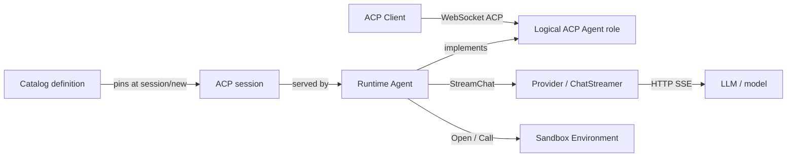
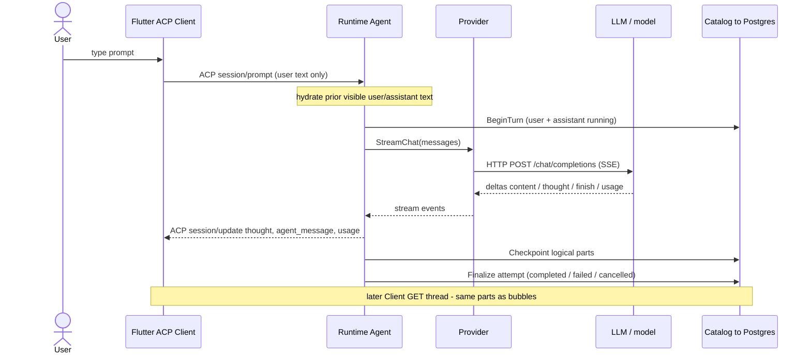
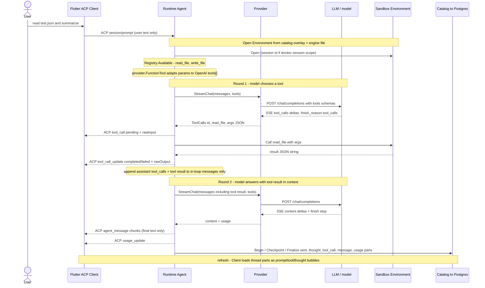
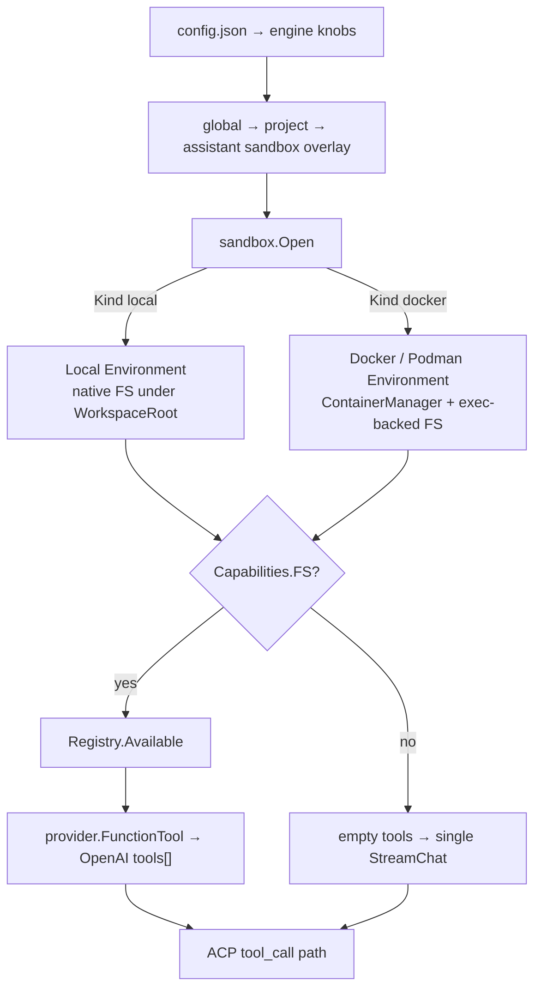
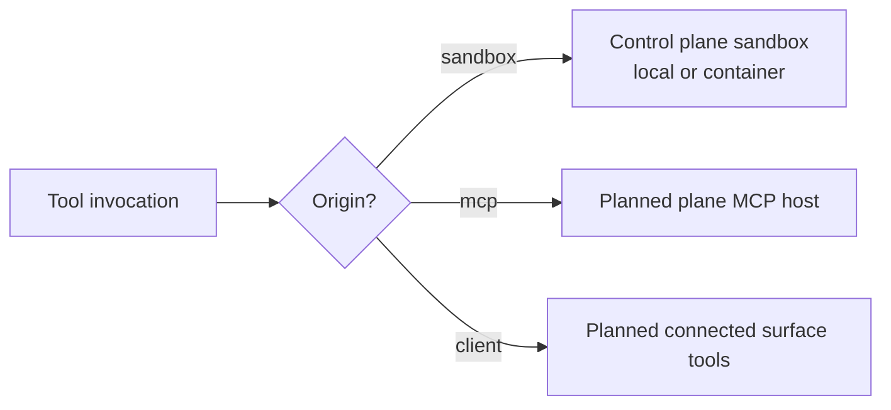

# Architecture

This describes the system that exists today and its explicitly deferred seams. Decisions that led here are in [decisions.md](decisions.md).

## Goal

A **central control plane** with a Flutter project workbench, with:

- Persisted thread history and per-assistant inference configuration on the server
- Per-assistant and per-project execution environment configuration
- Isolated execution (Docker) when an assistant needs a computer
- Tests that do not call a real LLM

Plane-hosted MCP execution starts as a narrow Streamable HTTP slice for plane-owned web integrations (`web_search` / `fetch_page`; see [#69](https://github.com/tryy3/agent-fabric/issues/69)). Generic MCP marketplace features and scoped memory remain planned ([#62](https://github.com/tryy3/agent-fabric/issues/62)).

Clients are replaceable cockpits. They do not own the agent runtime.

## Layers

```mermaid
flowchart TB
  subgraph surfaces [Surfaces]
    Flutter["Flutter web / app / desktop"]
    TUI[TUI]
    IDE["IDE Zed, …"]
  end

  subgraph plane [Control plane]
    Catalog[Assistant catalog]
    Sessions[Sessions]
    Execution environments[Execution environments]
    AcpRole["ACP Agent role<br/>one logical ACP Agent per Assistant"]
  end

  Inference["OpenAI-compatible / Unsloth / OpenCode"]

  Flutter -->|catalog API settings| Catalog
  TUI -->|catalog API settings| Catalog
  IDE -->|catalog API settings| Catalog

  Flutter -->|ACP v1 runtime| AcpRole
  TUI -->|ACP v1 runtime| AcpRole
  IDE -->|ACP v1 runtime| AcpRole

  AcpRole -->|provider API| Inference
```

ACP names two peers: **Client** and **Agent**. Inference is not a protocol actor. The control plane *implements* the ACP Agent role for each configured definition.

## Two APIs

| API | Audience | Job |
| --- | --- | --- |
| **Catalog** (our HTTP API) | Settings UI, admin | Create/update assistants, inference connections, projects, resources, execution settings, and policy metadata |
| **ACP v1** | Chat UI, TUI, IDEs | Talk to an *already configured* assistant |

ACP has no “create an assistant with this model.” It assumes the assistant exists. The catalog is how assistants exist. After the user picks `work`, the client opens ACP against that assistant and the rest is stock ACP (`initialize` → `session/new` → `session/prompt`).

Switching assistant is a **new session on a different definition**, not a field on the current turn. Small knobs *inside* a definition (ask vs auto, optional model set) can be ACP `configOptions`.

## Assistant definitions

A definition is internal config, versioned, hot-reloadable:

- Identity: id, name, description
- Provider: which inference backend and default model
- Allowed `configOptions` (optional model list, mode, …)
- Sandbox profile: none / Docker image / resource limits
- Tools and permission policy
- Prompt / policy text

MCP and memory-shaped settings may be stored in catalog JSON for future work, but neither creates a runtime capability today.

At `session/new`, the runtime **pins a snapshot** of the definition. In-flight turns do not mutate when you edit settings. The next session picks up the new version.

That pin includes **effective instructions**: Platform instructions and Runtime context (plane Settings) composed with Assistant instructions (Platform → Assistant → Runtime context), with named snake_case segment boundaries. Instruction variables (`{{currentDate}}`, `{{timezone}}`, `{{workspaceRoot}}`, `{{modelId}}`) are substituted at pin time. Empty sources are omitted. The ACP client cannot inject or override instructions on `session/new` or `session/prompt`. Adapters map the pinned value to each provider’s instruction wire form (see [inference providers](inference-providers.md)).

`initialize` capabilities come from that snapshot. Changing advertised capabilities requires a new connection (ACP negotiates capabilities once per connection).

One OS process can host many **logical** ACP Agents. Isolation is a property of the definition (in-process vs Docker), not “one subprocess per agent” unless we choose that later.

## Runtime path

When a client sends `session/prompt` to agent `work`:

1. Resolve the session’s pinned definition
2. Hydrate persisted visible thread history and reasoning parts
3. Resolve and open the sandbox environment, when enabled
4. Call that definition’s provider
5. Execute tools by **origin** (see below)
6. Stream ACP `session/update` (text, tool calls, plans, permissions)

The client never sends model, backend tools, MCP secrets, system prompt / instructions, or the canonical transcript. If an IDE still sends `cwd` / `mcpServers` on `session/new`, the plane **overrides from the definition**, except true **client-origin** tools (device MCP or `_` extension methods).

The next sections unpack that path: what “agent” means in this codebase, the live turn lifecycle, and how sandbox tools behave across backends.

## Concepts: what “agent” means

“Agent” is overloaded. These are different things:

| Term | Where it lives | What it is |
| --- | --- | --- |
| **Catalog agent definition** | Postgres / catalog HTTP API | Named config (provider, default model, inference settings, sandbox overlay, and future-facing metadata). Settings create and edit these. |
| **Logical ACP Agent** | Protocol role on the control plane | The peer the Client talks to (`initialize`, `session/*`). One OS process can host many logical agents. Inference is **not** an ACP peer. |
| **ACP session** | Runtime on the control plane | Conversation handle after `session/new`. Pins a definition snapshot and model for the life of the session. |
| **Runtime Agent** | Control plane process (our Go type) | Implements the ACP Agent role: prompt loop, streaming, tool loop, commit. |
| **Provider / ChatStreamer** | Control plane → HTTP | Inference client for `openai_compatible`, `unsloth_studio`, `berget_ai`, OpenCode Zen, or OpenCode Go. Custom, Unsloth, and Berget use Chat Completions; OpenCode routes per model across Chat Completions, Anthropic Messages, or Responses. See [inference providers](inference-providers.md). Not “the agent.” |
| **LLM / model** | Remote server (or test fake) | Token generator behind the provider’s wire API. Never speaks ACP. |
| **Sandbox Environment** | Control plane (local FS or container) | Where environment-origin tools run. `config.json` supplies host engine knobs (DB, listen, docker binary); overlay settings (image, kind, project root, idle TTL) come from catalog global → project → assistant. |

**Common confusion:** Choosing “Work” in Settings selects a **definition**. Chatting is still Client → ACP → runtime Agent → provider → LLM. Switching definition is a new session on a different logical agent, not a field on the current turn.

How the pieces relate (not a wire protocol — a vocabulary map):

```mermaid
flowchart LR
  Def[Catalog definition] -->|pins at session/new| Sess[ACP session]
  Sess -->|served by| RA[Runtime Agent]
  RA -->|implements| Role[Logical ACP Agent role]
  Client[ACP Client] -->|WebSocket ACP| Role
  RA -->|StreamChat| Prov[Provider / ChatStreamer]
  Prov -->|HTTP SSE| LLM[LLM / model]
  RA -->|Open / Call| Env[Sandbox Environment]
```

## Turn lifecycle

Physical pieces (same for both diagrams below):

| Diagram label | Physical piece |
| --- | --- |
| **Flutter ACP Client** | App / browser on the user’s device |
| **Runtime Agent** | Go controlplane process (ACP Agent role) |
| **Provider** | Same controlplane process — OpenAI-compatible HTTP client |
| **LLM / model** | Separate inference server (or test fake) |
| **Sandbox Environment** | Same controlplane process — local FS jail or docker/podman container |
| **Catalog** | Same controlplane process writing Postgres (`BeginTurn` / checkpoint / `Finalize`); client reloads later over catalog HTTP |

Happy path without tools:

```mermaid
sequenceDiagram
  actor User
  participant Client as Flutter ACP Client
  participant Agent as Runtime Agent
  participant Prov as Provider
  participant LLM as LLM / model
  participant Catalog as Catalog to Postgres

  User->>Client: type prompt
  Client->>Agent: ACP session/prompt (user text only)
  Note over Agent: hydrate prior visible user/assistant text
  Agent->>Catalog: BeginTurn (user + assistant running)
  Agent->>Prov: StreamChat(messages)
  Prov->>LLM: HTTP POST /chat/completions (SSE)
  LLM-->>Prov: deltas content / thought / finish / usage
  Prov-->>Agent: stream events
  Agent-->>Client: ACP session/update thought, agent_message, usage
  Agent->>Catalog: Checkpoint logical parts
  Agent->>Catalog: Finalize attempt (completed / failed / cancelled)
  Note over Client,Catalog: later Client GET thread - same parts as bubbles
```

1. Client opens WebSocket to `/acp` and speaks ACP as **Client**.
2. `initialize` negotiates capabilities; `session/new` creates or binds a session (and may bind a catalog thread), pinning definition + model.
3. User sends `session/prompt` with user content only — no model, backend tools, or canonical transcript from the client.
4. Runtime Agent builds the in-loop message list (prior **visible** user/assistant text from the thread, plus this prompt).
5. Plane **BeginTurn** persists the user prompt and a `running` assistant attempt before the first provider request.
6. Provider streams Chat Completions; the LLM returns deltas; the provider maps them to internal events (thought, content, finish, usage, tool_calls).
7. Runtime Agent emits ACP `session/update` for the cockpit and **checkpoints** complete logical parts until the turn stops.
8. Plane **Finalize**s the attempt (`completed`, `failed`, or `cancelled`). The **next** prompt’s LLM hydrate stays active user text plus **completed** active assistants only.
9. Provider HTTP hops are scrubbed and stored in `hop_captures` (see [chat-inspector-capture design](superpowers/specs/2026-09-27-chat-inspector-capture-design.md)); the cockpit Inspector lazy-loads them in Raw view mode. Cancel and failure link captures on finalize rather than deleting them.

### With tools (current POC)

Same layers, plus the sandbox. Data crosses **three different protocols** at different hops:

| Hop | Protocol / shape | Example payload |
| --- | --- | --- |
| Client ↔ Agent | ACP `session/*` / `session/update` | `tool_call` with `rawInput`; never OpenAI `tools` |
| Agent ↔ Provider ↔ LLM | OpenAI Chat Completions | `tools[]`, `tool_calls`, `role: tool` messages |
| Agent ↔ Sandbox | In-process Registry.Call | tool name + JSON args → JSON result string |

Concrete turn: model calls `read_file`, then answers. (Participant locations are in the table above.)

```mermaid
sequenceDiagram
  actor User
  participant Client as Flutter ACP Client
  participant Agent as Runtime Agent
  participant Prov as Provider
  participant LLM as LLM / model
  participant Env as Sandbox Environment
  participant Catalog as Catalog to Postgres

  User->>Client: read test.json and summarize
  Client->>Agent: ACP session/prompt (user text only)

  Note over Agent,Env: Open Environment from catalog overlay + engine file
  Agent->>Env: Open (session id if docker session scope)
  Note over Agent: Registry.Available - read_file, write_file
  Note over Agent: provider.FunctionTool adapts params to OpenAI tools[]

  Note over Agent,LLM: Round 1 - model chooses a tool
  Agent->>Prov: StreamChat(messages, tools)
  Prov->>LLM: POST /chat/completions with tools schemas
  LLM-->>Prov: SSE tool_calls deltas, finish_reason tool_calls
  Prov-->>Agent: ToolCalls id, read_file, args JSON

  Agent-->>Client: ACP tool_call pending + rawInput
  Agent->>Env: Call read_file with args
  Env-->>Agent: result JSON string
  Agent-->>Client: ACP tool_call_update completed/failed + rawOutput
  Note over Agent: append assistant tool_calls + tool result to in-loop messages only

  Note over Agent,LLM: Round 2 - model answers with tool result in context
  Agent->>Prov: StreamChat(messages including tool result, tools)
  Prov->>LLM: POST /chat/completions
  LLM-->>Prov: SSE content deltas + finish stop
  Prov-->>Agent: content + usage
  Agent-->>Client: ACP agent_message chunks (final text only)
  Agent-->>Client: ACP usage_update

  Agent->>Catalog: Begin / Checkpoint / Finalize sent, thought, tool_call, message, usage parts
  Note over Client,Catalog: refresh - Client loads thread parts as prompt/tool/thought bubbles
```

Sandbox tools run through a **Gate** (`allow` / `ask` / `deny`) before execution. `ask` uses ACP `session/request_permission` (Allow once / Allow for this session / Reject). Hard `deny` returns a failed tool result with no user prompt. Path escapes and policy misses ask by default; sensitive write targets (for example under `/etc`) hard-deny. The plane-owned `ask_user` tool uses ACP `elicitation/create` (form) for mid-turn clarification — separate from permission UX. Tool-round prose is kept on the OpenAI assistant message for the model; it is **not** streamed as ACP agent message chunks (those appear on the final text round only). Max **8** tool rounds per Prompt; if the model keeps calling tools, the loop stops with an error after that.

### What each peer sees

| Peer | Sees |
| --- | --- |
| **Client** | ACP `session/update` (sent via `session_info_update` meta / thought / tool_call / tool_call_update / agent_message / usage). Catalog HTTP reloads the same turn as ordered `parts`. |
| **Runtime Agent** | Full OpenAI tool transcript **within the current Prompt** (assistant `tool_calls` + `tool` role messages). |
| **LLM** | Chat Completions `messages` and optional `tools`. Never ACP. |
| **Next Prompt’s LLM** | Prior user + assistant **visible text**, plus assistant **reasoning** when present (`reasoning_content` / equivalent). Tool I/O is still UI/transcript only across prompts (in-prompt tool rounds keep the OpenAI tool transcript). |

## Tools and sandbox backends

Sandbox tools (`ask_user`, `read_file`, `write_file` today) are **registry** tools with provider-neutral parameter schemas. The agent adapts them to OpenAI `tools[]` via `provider.FunctionTool`. The model only sees names and JSON Schema on Chat Completions; it never chooses the backend.

| Backend (`OpenOptions.Kind`) | Where work runs | How filesystem works | Isolation |
| --- | --- | --- | --- |
| **local** | Control plane host process | Native I/O under `WorkspaceRoot` (path jail; reject escapes) | Process + root jail only |
| **docker** | Long-lived container (Podman preferred when available) | Exec-backed FS over the container executor | Container `--name` from the overlay template (default `agent-fabric-container-{projectID}`); named volume `agent-fabric.proj.{id}` |

**Per Prompt:** load engine knobs from CWD `config.json` → merge global `plane_settings` with project and agent `settings.sandbox` → resolve the thread’s project → `Open` an Environment (project volume `agent-fabric.proj.{id}` or local `{dataDir}/projects/{id}/workspace`) → register file tools → `Available(env)` → adapt with `provider.FunctionTool` → tool loop (no FS ⇒ empty tools ⇒ single StreamChat as before). Global image changes apply on the next prompt.

```mermaid
flowchart TB
  Config["config.json → engine knobs"] --> Overlay["global → project → assistant sandbox overlay"]
  Overlay --> Open["sandbox.Open"]
  Open -->|Kind local| Local["Local Environment<br/>native FS under WorkspaceRoot"]
  Open -->|Kind docker| Docker["Docker / Podman Environment<br/>ContainerManager + exec-backed FS"]
  Local --> Caps{Capabilities.FS?}
  Docker --> Caps
  Caps -->|yes| Tools["Registry.Available"]
  Caps -->|no| None["empty tools → single StreamChat"]
  Tools --> Adapt["provider.FunctionTool → OpenAI tools[]"]
  Adapt --> SamePath["ACP tool_call path"]
  None --> SamePath
```

**Layering:** sandbox owns tool identity, parameter schemas, and `Run`. The agent/provider boundary wraps those schemas into OpenAI Chat Completions `tools[]` — sandbox does not know about `type: "function"`.

POC limits (intentional): MCP and client-origin tool execution are deferred; live classifier/JEV evaluators are a Gate slot only (hardcoded rules ship first).

## Further reading

| Doc | When to read it |
| --- | --- |
| [decisions.md](decisions.md) | Why ACP + catalog + execution origins |
| [sandbox FS tools design](superpowers/specs/2026-09-15-sandbox-fs-tools-design.md) | Environment, local vs docker, registry, config layers |
| [sandbox tool calling design](superpowers/specs/2026-09-16-sandbox-tool-calling-design.md) | End-to-end tools, ACP raw I/O, Flutter bubbles, hydrate rules |
| [OpenAI inference design](superpowers/specs/2026-09-12-controlplane-openai-inference-design.md) | Provider boundary and streaming |
| [chat transparency design](superpowers/specs/2026-09-14-chat-transparency-design.md) | Thoughts, usage, ordered parts |
| [threads / history design](superpowers/specs/2026-09-13-threads-history-design.md) | Thread bind and CommitTurn |

## Execution surfaces

Where work runs is a runtime concern, not “whatever ACP `fs/*` means.”

| Origin | Examples | Runs |
| --- | --- | --- |
| `sandbox` / `environment` | files, shell, code exec | Docker (or none) on the control plane |
| `mcp` | `web_search`, `fetch_page` (plane integrations); future user MCP | Plane integration drivers + narrow Streamable HTTP MCP ([#69](https://github.com/tryy3/agent-fabric/issues/69); generic MCP in [#62](https://github.com/tryy3/agent-fabric/issues/62)) |
| `client` | clipboard, localStorage, IDE buffers | Planned: connected-surface round-trip |

```mermaid
flowchart LR
  ToolCall[Tool invocation] --> Origin{Origin?}
  Origin -->|sandbox| PlaneSB[Control plane sandbox<br/>local or container]
  Origin -->|mcp| PlaneMCP[Planned plane MCP host]
  Origin -->|client| Surface[Planned connected surface tools]
```

A phone advertises client tools like clipboard and **no** host filesystem. A TUI may advertise real host fs/terminal *as client-origin tools* (or v1 `fs/*` / `terminal/*` if we ever enable them for that surface). Docker is always `sandbox`, never ACP `fs/*`.

ACP v1 *can* call `fs/*` on a client that advertised it. We do not map that to Docker. v2 is removing client fs/terminal from the protocol; we already behave as if that were true.

## Surfaces

**Flutter** is the first-party cockpit (web, iOS, Android, desktop): project/thread navigation, a dockable workspace, transcript, permissions, settings, and project file views. It is not an agent framework.

**TUI** is optional and closer to an IDE (real cwd, maybe host tools). It should speak ACP against the same agents.

**IDEs** are ACP clients against the same logical agents. File buffers may round-trip to the editor; isolated execution still goes to the plane’s sandbox.

A first-party **thin session API** is not required if Flutter speaks ACP. We still own the catalog HTTP API. If remote ACP (HTTP/WebSocket) is too rough for Flutter web, a thin transport that carries the same ACP JSON-RPC (or a WebSocket) is an implementation detail, not a second product protocol.

## Memory (planned)

The live runtime replays a thread’s persisted visible messages and reasoning parts. It does not yet maintain or retrieve session, project, or long-term memory records. When implemented, memory will live on the plane; clients will inspect it rather than implement it.

| Scope | Lifetime | Injected |
| --- | --- | --- |
| Working | this turn | recent transcript |
| Session | this thread | every turn in the session |
| Project | this workspace / repo | every turn in that project |
| Long-term | across projects | profile always-on; rest retrieved |

Start with keyed records and search (FTS is enough). A vector index is optional later.

## Inference

The provider is an interface. Live definitions use the catalog’s supported provider adapters. Tests inject deterministic fake streamers, so CI does not call a real LLM.

The client sees capabilities and optional model `configOptions`, not a vendor SDK.

## Protocol map (what we are *not* using as the spine)

| Protocol | Role here |
| --- | --- |
| **ACP v1** | Runtime: client ↔ logical agent |
| **MCP** | Planned agent ↔ tools/data integration; not wired into the runtime yet |
| **Catalog HTTP** | Settings / definitions |
| AG-UI | Not the application API. Optional later as a codec if some widget needs it |
| ACP v2 | Direction for internals; second wire adapter when it stabilizes |
| A2A | Not needed for v1 of this product |

Remote ACP HTTP/WebSocket is still a draft (separate from v1 vs v2). Stdio is the stable ACP transport (IDE spawns a process). Our hosted case needs a remote transport; WebSocket is the realistic Flutter path until the RFD settles.

## What we are not building first

- Full ACP v2 wire support
- Inventing a competing token-stream protocol
- Client-owned MCP/model config on each chat request
- Scoped memory retrieval / vector DB
- Auth/identity product (can stay local/single-user until needed)
- Multi-tenant SaaS

## Testing stance

Assert against the **internal runtime** (definition pin, persisted-thread hydration, provider routing, “client cannot inject backend tools”). ACP encoding is tested with fixtures. Injected fake streamers mean CI never needs API keys.
