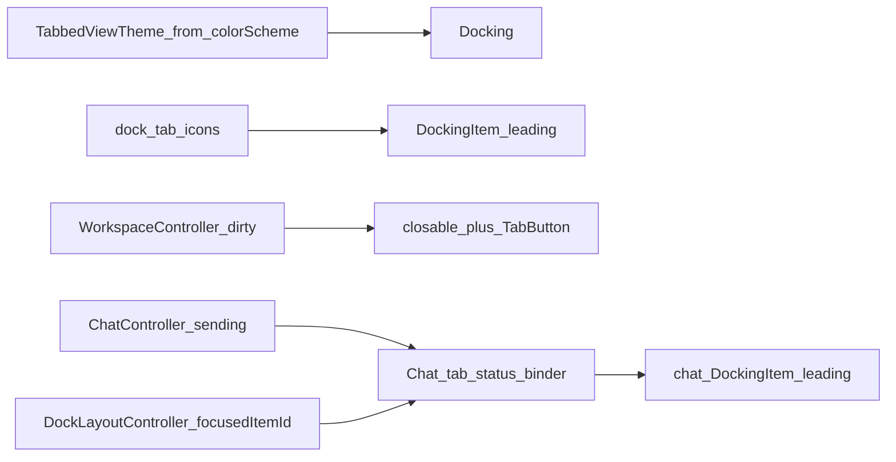

# Dock tab chrome & status indicators

## Goal

Make dock tabs read as IDE tabs — clear active/inactive separation, type icons, and a small status set — without replacing `docking` / `tabbed_view`. This extends [dockable panes](2026-09-23-dockable-panes-design.md), which deferred perfect visual match for v1.

## Decisions

| Topic | Choice |
| --- | --- |
| Approach | Theme + package hooks (`TabbedViewTheme`, `DockingItem.leading`, `TabButton`) — no custom tab-strip rewrite |
| Visual language | Hybrid + Soft: subtle strip/dividers + thin active top accent; Cursor-like text contrast (muted inactive, high-contrast active — white on dark / onSurface on light) |
| Dirty editors | VS Code-style: filled circle replaces close `×` until hover |
| Chat status scope | Unfocused sending → loading; unfocused done + unread → blue leading dot; focused → always plain chat icon |
| Unread clear | Selecting the chat tab clears unread (no scroll-to-bottom) |
| App/browser blur | Ignored — status only cares about dock tab selection |
| Background turns | No transport work — `ChatController` already owns the session; chat `keepAlive` keeps the widget mounted |
| File icons | Generic type icons by core / `WorkspaceAppId` — no per-language icons in v1 |
| Unread persistence | Not persisted across restarts |

## Visual chrome

**Tab strip**

- Slightly elevated strip behind inactive tabs so the row reads as a tab bar.
- Subtle vertical dividers between tabs (not full outlined chips).
- Active tab: same fill as the content area, high-contrast title (`onSurface` / white on dark), thin top accent from `colorScheme.primary`.
- Inactive tabs: muted title and icon (`onSurface` at ~40–45% opacity), quieter close control.
- Theme built from `Theme.of(context).colorScheme` (and appearance settings where practical), wrapped around `Docking` in `AppShell`.

**Type icons (leading)**

| Item | Icon role |
| --- | --- |
| `threads` | Threads / forum |
| `files` | Folder |
| `chat` | Chat (plain when focused) |
| Text editor | Generic document |
| Web / image / other preview | Matching preview / media glyph |

## Status behavior

### Documents (dirty)

- When `FileDocument` is dirty for that dock id: hide the native close control (`closable: false`) and show a hover-aware `TabButton` that displays a filled circle until hover, then `×`, then closes (existing dirty save/discard confirm stays).
- When clean: normal closable `×`.
- Each dirty tab is independent.

**Fallback:** If hover-swap is awkward with `tabbed_view` APIs, show a dirty circle beside a normal `×` and note it in the PR — do not fork the package in v1.

### Chat

| Condition | Leading |
| --- | --- |
| Chat tab selected (even while `sending`, even if browser/app blurred) | Plain chat icon; clear unread |
| Another dock item focused + `ChatController.sending` | Loading indicator |
| Another dock item focused + turn finished + unread | Colored notification dot (Cursor-style) |
| After selecting chat (unread cleared) then leaving again with nothing pending | Plain chat icon |

**Unread set:** When a prompt turn completes (`sending` → false) while the focused dock item is not `chat`, set unread.

**Closing the chat pane:** No tab to decorate; controller keeps running. On reopen, apply the same rules if the item exists again (plain unless still sending or unread).

## Architecture

- **Theme:** One `TabbedViewThemeData` in `AppShell` around the existing `Docking` host.
- **Icons helper:** Small module (e.g. `client/lib/dock/dock_tab_icons.dart`) maps core ids / app ids → leading widgets.
- **Dirty wiring:** When document dirty flips, update the matching `DockingItem` close UI from `WorkspaceController` / shell glue.
- **Chat binder:** Thin listener on `ChatController` + `focusedItemId` that updates the chat item’s `leading` and an in-memory unread flag. No WebSocket or ACP changes.

## Out of scope

- Per-message “new since last visit” markers
- Language-specific editor icons
- Custom / forked tab strip
- Persisting unread across restarts
- Treating OS/browser focus as chat “unfocused”

## Testing

- Theme builds under light and dark `colorScheme`.
- Dirty doc: circle replaces `×`; hover restores `×`; close still runs existing dirty confirm.
- Chat unfocused + sending → loading leading; turn completes unfocused → unread dot; select chat → plain icon and unread cleared.
- Chat focused while sending → plain icon (no spinner).
- App blur while chat selected → no status change (manual / documented expectation; automate only if a harness exists).

## Success criteria

- Users can tell which tab is active at a glance (fill + high-contrast vs muted text).
- Tabs look clickable without heavy chip borders.
- Dirty and chat activity are visible on the tab without opening the pane.
- Agent turns continue while chat is offstage; chrome only reflects existing controller state.
