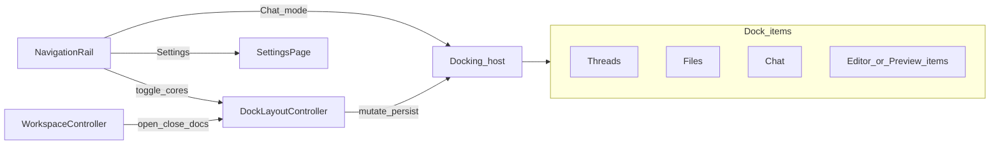

# Dockable panes (VS Code–style layout)

## Goal

Replace the fixed-width desktop columns (Threads | Workspace | Chat) with a resizable, rearrangable dock host so users can split panes, tab views together, and reopen closed cores from the nav rail — similar to VS Code / Zed.

## Decisions

| Topic | Choice |
| --- | --- |
| Ambition | Full docking (splits + tabs + drag rearrange) |
| Package | [`docking`](https://pub.dev/packages/docking) (`multi_split_view` + `tabbed_view`) |
| Chrome | Navigation rail stays fixed; dock hosts Chat-mode content |
| View granularity | Cores + **each** open editor/preview as its own dock item |
| Close / reopen | Cores closable; rail toggles re-add or focus them |
| Persistence | Shell layout only (positions, weights, which cores are present) — **not** open documents |
| Default layout | Classic IDE: Threads \| Files \| Chat (first file opens into the focused group / split) |
| Open placement | Into the **focused** dock group; “Open to the side” splits relative to focus |
| Narrow viewports | Unchanged: `< 720` uses full-screen `WorkspacePage`; docking is desktop-only for v1 |
| Implementation | Adopt `docking` directly with a thin `DockLayoutController` (no multi-backend facade) |

## Architecture

- **Fixed chrome:** `NavigationRail` remains outside the dock. Destination order: **Chat**, **Threads** (toggle), **Files** (toggle), **Settings**. Connectivity badge stays on the rail trailing area.
- **Chat mode host:** `AppShell` body is `Row(rail, Expanded(IndexedStack))` instead of fixed Threads / Workspace / Chat columns. Index 0 = `Docking` host; index 1 = `SettingsPage`.
- **Settings mode:** Selecting Settings sets the `IndexedStack` index to Settings. The `Docking` subtree stays mounted (offstage) so Chat ACP and editor `keepAlive` state are preserved.
- **`DockLayoutController`:** Owns `DockingLayout`, focused-item tracking, core show/hide, open-file placement into the focused group, and persist/restore of the shell layout.
- **`WorkspaceController`:** Keeps document state (bytes, dirty, save, git, file tree). No longer owns `paneOpen`, `groups`, or `_placeView`. Opening a view asks the dock controller to add a `DockingItem`.

## Views and interactions

### Core panels (stable IDs)

| ID | Content |
| --- | --- |
| `threads` | Today’s `ThreadPane` |
| `files` | File explorer only (not editors) |
| `chat` | Today’s `ChatScreen` without the Files header toggle (rail owns that) |

### Document panels (dynamic IDs)

- One `DockingItem` per open view: `doc:{path}:{appId}` (text editor, web preview, image, etc.).
- Title / leading from path + app. Closable. `keepAlive: true` so editor/preview state survives tab switches and rearranges.

### Open / place

- Open from Files → add (or focus existing) item in the **focused** dock group.
- “Open to the side” → programmatic split relative to the focused group.
- Replaces today’s max-two `EditorGroup` model in `WorkspaceController`.

### Close / reopen cores

- Threads and Files: closable. Rail toggles re-insert as a left split of the current root (Threads leftmost, Files after Threads if both open) if missing, or select/focus the existing item if present. Closing removes from layout; controllers are not disposed.
- Chat: closable. Selecting the Chat rail destination switches to Chat mode and reopens the `chat` item (rightmost in the root row) if it was closed.
- Document close: remove dock item; drop the corresponding open view from `WorkspaceController`. Dirty files: confirm save/discard before remove (reuse or add a simple confirm).

### Default layout

First run / reset: `DockingRow([threads, files, chat])` with initial weights **0.18 / 0.16 / 0.66**. No permanent empty Editors panel — the first open file lands in the focused group or splits beside it.

### Persistence

- On layout change: persist via `DockingLayout.stringify` (or a cores-only snapshot derived from it) into `shared_preferences`.
- Do **not** persist document items. On restore, rebuild a cores-only layout (strip unknown / `doc:` IDs) or restore a cores-only snapshot.
- Restore failure or unknown version → fall back to default classic layout; do not crash.

### Project switch

Close all document dock items; keep core panels; reload the file tree (same clear-on-project-change behavior as today).

### Narrow viewports (`width < 720`)

Unchanged: Files opens full-screen `WorkspacePage`. Docking is desktop-only for v1.

## Components and migration

### Dependencies

Add `docking` to `client/pubspec.yaml` (brings `multi_split_view` and `tabbed_view`).

### New

- `client/lib/dock/dock_layout_controller.dart` — layout CRUD, focus, persist, rail toggle helpers.
- Thin builders that wrap cores / docs as `DockingItem` widgets (document body reused from today’s workspace view switch on `WorkspaceAppId`).

### Changed

- [`client/lib/app_shell.dart`](client/lib/app_shell.dart) — rail + dock host; rail gains Threads / Files toggles; drop fixed 240 / 360 columns.
- [`client/lib/workspace/workspace_controller.dart`](client/lib/workspace/workspace_controller.dart) — remove `paneOpen`, `groups`, `_placeView`; keep docs / tree / git / save; notify dock controller on open/close.
- [`client/lib/workspace/workspace_pane.dart`](client/lib/workspace/workspace_pane.dart) — desktop host role shrinks; file explorer and view bodies remain useful as dock item content; mobile `WorkspacePage` can keep a simpler non-dock layout.
- Remove the Chat header Files toggle; the rail Files destination is the only Files show/hide control on desktop.

### Edge cases

- Closing the last tab in a group collapses that area (package behavior).
- Theme dock dividers / tabs to fit existing `material_ui` / appearance settings where practical; perfect visual match is not a blocker for v1.

## Testing

- **Unit:** `DockLayoutController` — default layout; toggle core add/remove; open into focused group; open-to-side creates a split; persist round-trip strips document IDs; corrupt prefs → default layout.
- **Widget:** Shell shows rail toggles; Files toggle adds/removes the `files` item; opening a file adds a dock tab. Adapt [`client/test/app_shell_test.dart`](client/test/app_shell_test.dart) and workspace tests.

No backend or catalog API changes.

## Out of scope (v1)

- `dock_panel` / Riverpod
- Persisting open documents
- Detachable OS windows
- Docking on narrow / `WorkspacePage`
- Settings as a dock panel
- Layout presets UI (a simple “reset layout” later is fine; not required for v1)

## Success criteria

- With Threads, Files, Chat, and multiple editors open, the user can resize panes and tab or split views so no column is stuck at a tiny fixed width.
- Closed Threads / Files / Chat can be restored from the rail.
- Restart restores shell layout (cores + sizes), not open files.
- Chat ACP session survives Settings navigation and dock rearranges (`keepAlive`).
